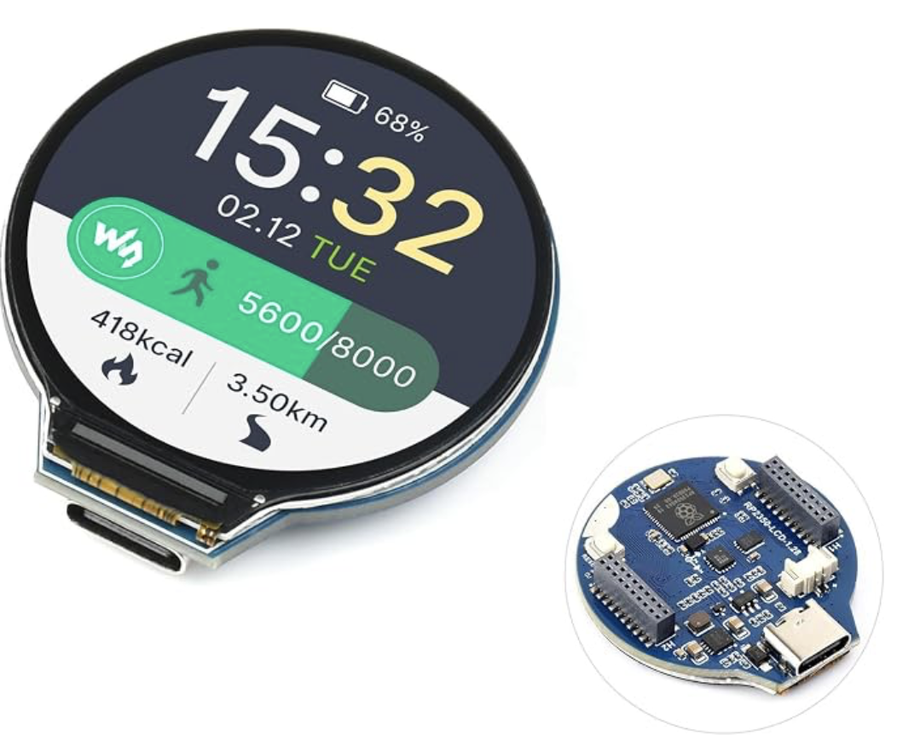

# waveshare-rpi2350-round-128-lcd-piggyback
Piggyback hacking PCBs for the Waveshare RPi2350/2040 round 1.28 inch 240x240 LCD

These are piggyback style GPIO access connector PCBs for the Waveshare 1.28 inch round LCD with RPi2350/2040 type controller.
Amazon product link example: [https://www.amazon.com/dp/B0DM1CB4YV](https://www.amazon.com/dp/B0DM1CB4YV)

