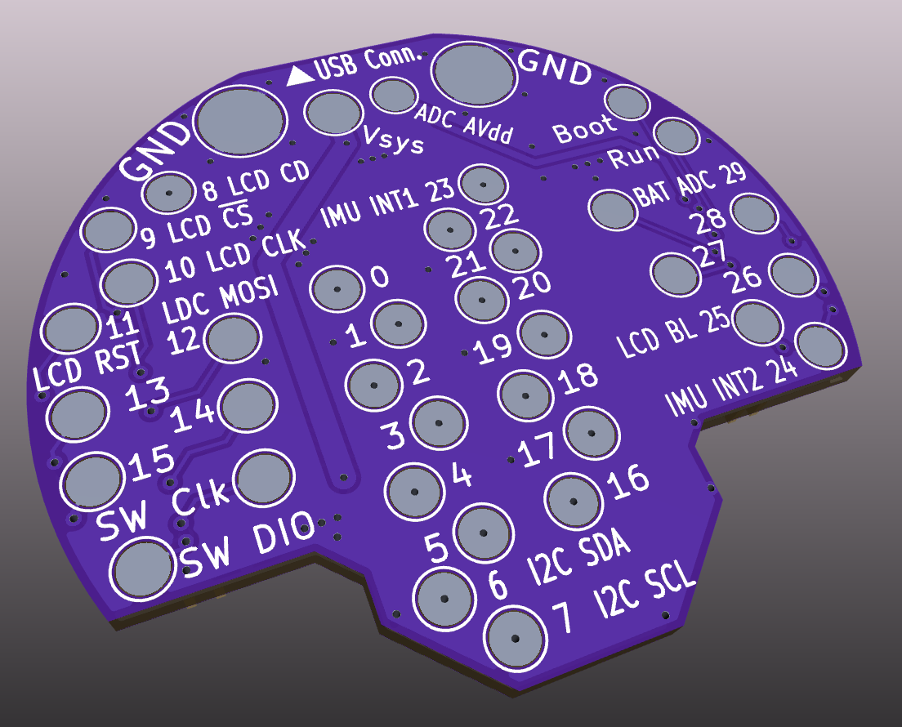
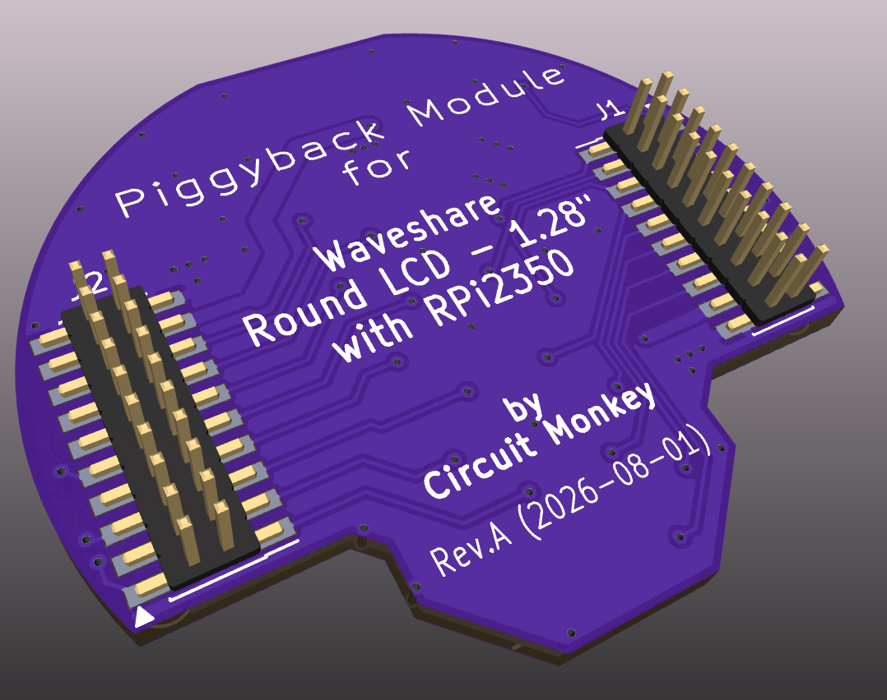

# waveshare-rpi2350-round-128-lcd-piggyback
Piggyback hacking PCB for the Waveshare RPi2350/2040 round 1.28 inch 240x240 LCD

Gain solder level access to the header pins on the back of this LCB module!

These are piggyback style GPIO access connector PCBs for the Waveshare 1.28 inch round LCD with RPi2350/2040 type controller.
Amazon product link example: [https://www.amazon.com/dp/B0DM1CB4YV](https://www.amazon.com/dp/B0DM1CB4YV)

If you want to try one of these boards, simply upload the PCB KiCAD design to https://oshpark.com

